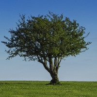

[Main](#main) [Me](#me) [skills](#skills) [works](#works) [Contacts](#contacts)
# **IT'S MY PAGE** 
## **and my information** 
 
## **Some words about me:** 
- My name is Klimentsii(Климентий). 
- I'm 19 years old. 
- I'm a student of MITSO university in Minsk. 
- I'm a 4th year student of the IT specialty. 
### **Now, brifly about my skills** 
- Illustrator 
- After Effects 
- Figma 
- FL Studio (some music :D) 
- Power Point 
### **And my languages** 
- SEO (50%) 
- English (B1) 
- Html (99%) 
- Css (80%) 
- Js (10%) 
- Java (10%) 

#### **And now some words about my works** 
 

Made up the site for "Склад металла", made a logo, developed a design and promoted to the top using SEO up to 2nd place [psklad](https://psklad.by)

 

I made this site for myself(I wanted to do logomaking). I also took up design and made a logo. [logodo](http://logodo.by)

 

Layout, design and logo.I also promoted SEO, but stoped and the site is not included in the top [traditions](http://traditions.by)

- <klimparh@gmail.com>
- [+375-25-698-36-64](tel:+375256983664)
- [Telegram](https://t.me/klimentsii)
- [Instagram](https://www.instagram.com/klimentsii/)
- [GitHub](https://github.com/klimentsii)
- 
- 2021
